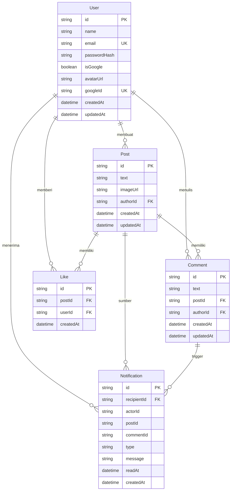

# Database Diagram

Diagram skema database untuk target PPWL saat ini.

```mermaid
erDiagram
  User ||--o{ Post : membuat
  User ||--o{ Comment : menulis
  User ||--o{ Like : memberi
  User ||--o{ Notification : menerima
  Post ||--o{ Comment : memiliki
  Post ||--o{ Like : memiliki
  Post ||--o{ Notification : sumber
  Comment ||--o{ Notification : trigger

  User {
    string id PK
    string name
    string email UK
    string passwordHash
    boolean isGoogle
    string avatarUrl
    string googleId UK
    datetime createdAt
    datetime updatedAt
  }

  Post {
    string id PK
    string text
    string imageUrl
    string authorId FK
    datetime createdAt
    datetime updatedAt
  }

  Comment {
    string id PK
    string text
    string postId FK
    string authorId FK
    datetime createdAt
    datetime updatedAt
  }

  Like {
    string id PK
    string postId FK
    string userId FK
    datetime createdAt
  }

  Notification {
    string id PK
    string recipientId FK
    string actorId
    string postId
    string commentId
    string type
    string message
    datetime readAt
    datetime createdAt
  }
```
